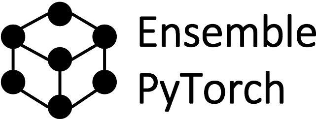

|github|_ |readthedocs|_ |codecov|_ |license|_

.. |github| image:: https://github.com/TorchEnsemble-Community/Ensemble-Pytorch/workflows/torchensemble-CI/badge.svg
.. _github: https://github.com/TorchEnsemble-Community/Ensemble-Pytorch/actions

.. |readthedocs| image:: https://readthedocs.org/projects/ensemble-pytorch/badge/?version=latest
.. _readthedocs: https://ensemble-pytorch.readthedocs.io/en/latest/index.html

.. |codecov| image:: https://codecov.io/gh/TorchEnsemble-Community/Ensemble-Pytorch/branch/master/graph/badge.svg?token=2FXCFRIDTV
.. _codecov: https://codecov.io/gh/TorchEnsemble-Community/Ensemble-Pytorch

.. |license| image:: https://img.shields.io/github/license/TorchEnsemble-Community/Ensemble-Pytorch
.. _license: https://github.com/TorchEnsemble-Community/Ensemble-Pytorch/blob/master/LICENSE

Ensemble PyTorch
================

A unified ensemble framework for pytorch_ to easily improve the performance and robustness of your deep learning model. Ensemble-PyTorch is part of the `pytorch ecosystem <https://pytorch.org/ecosystem/>`__, which requires the project to be well maintained.

* `Document <https://ensemble-pytorch.readthedocs.io/>`__
* `Experiment <https://ensemble-pytorch.readthedocs.io/en/stable/experiment.html>`__

Installation
------------

.. code:: bash

    pip install torchensemble

Example
-------

.. code:: python

    from torchensemble import VotingClassifier  # voting is a classic ensemble strategy

    # Load data
    train_loader = DataLoader(...)
    test_loader = DataLoader(...)

    # Define the ensemble
    ensemble = VotingClassifier(
        estimator=base_estimator,               # estimator is your pytorch model
        n_estimators=10,                        # number of base estimators
    )

    # Set the optimizer
    ensemble.set_optimizer(
        "Adam",                                 # type of parameter optimizer
        lr=learning_rate,                       # learning rate of parameter optimizer
        weight_decay=weight_decay,              # weight decay of parameter optimizer
    )
    
    # Set the learning rate scheduler
    ensemble.set_scheduler(
        "CosineAnnealingLR",                    # type of learning rate scheduler
        T_max=epochs,                           # additional arguments on the scheduler
    )

    # Train the ensemble
    ensemble.fit(
        train_loader,
        epochs=epochs,                          # number of training epochs
    )

    # Evaluate the ensemble
    acc = ensemble.evaluate(test_loader)         # testing accuracy

Supported Ensemble
------------------

+------------------------------+------------+---------------------------+-----------------------------+
|       **Ensemble Name**      |  **Type**  |      **Source Code**      |          **Problem**        |
+==============================+============+===========================+=============================+
|            Fusion            |    Mixed   |         fusion.py         | Classification / Regression |
+------------------------------+------------+---------------------------+-----------------------------+
|          Voting [1]_         |  Parallel  |         voting.py         | Classification / Regression |
+------------------------------+------------+---------------------------+-----------------------------+
|         Neural Forest        |  Parallel  |         voting.py         | Classification / Regression |
+------------------------------+------------+---------------------------+-----------------------------+
|         Bagging [2]_         |  Parallel  |         bagging.py        | Classification / Regression |
+------------------------------+------------+---------------------------+-----------------------------+
|    Gradient Boosting [3]_    | Sequential |    gradient_boosting.py   | Classification / Regression |
+------------------------------+------------+---------------------------+-----------------------------+
|    Snapshot Ensemble [4]_    | Sequential |    snapshot_ensemble.py   | Classification / Regression |
+------------------------------+------------+---------------------------+-----------------------------+
|   Adversarial Training [5]_  |  Parallel  |  adversarial_training.py  | Classification / Regression |
+------------------------------+------------+---------------------------+-----------------------------+
| Fast Geometric Ensemble [6]_ | Sequential |     fast_geometric.py     | Classification / Regression |
+------------------------------+------------+---------------------------+-----------------------------+
|  Soft Gradient Boosting [7]_ |  Parallel  | soft_gradient_boosting.py | Classification / Regression |
+------------------------------+------------+---------------------------+-----------------------------+

Dependencies
------------

-  scikit-learn>=0.23.0
-  torch>=1.4.0
-  torchvision>=0.2.2

Reference
---------

.. [1] Zhou, Zhi-Hua. Ensemble Methods: Foundations and Algorithms. CRC press, 2012.

.. [2] Breiman, Leo. Bagging Predictors. Machine Learning (1996): 123-140.

.. [3] Friedman, Jerome H. Greedy Function Approximation: A Gradient Boosting Machine. Annals of Statistics (2001): 1189-1232.

.. [4] Huang, Gao, et al. Snapshot Ensembles: Train 1, Get M For Free. ICLR, 2017.

.. [5] Lakshminarayanan, Balaji, et al. Simple and Scalable Predictive Uncertainty Estimation using Deep Ensembles. NIPS, 2017.

.. [6] Garipov, Timur, et al. Loss Surfaces, Mode Connectivity, and Fast Ensembling of DNNs. NeurIPS, 2018.

.. [7] Feng, Ji, et al. Soft Gradient Boosting Machine. ArXiv, 2020.

.. _pytorch: https://pytorch.org/

.. _pypi: https://pypi.org/project/torchensemble/

Thanks to all our contributors
------------------------------

|contributors|

.. |contributors| image:: https://contributors-img.web.app/image?repo=TorchEnsemble-Community/Ensemble-Pytorch
.. _contributors: https://github.com/TorchEnsemble-Community/Ensemble-Pytorch/graphs/contributors
