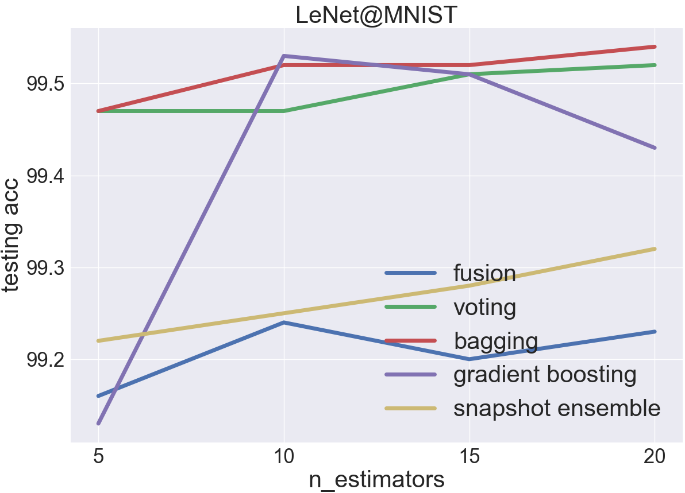
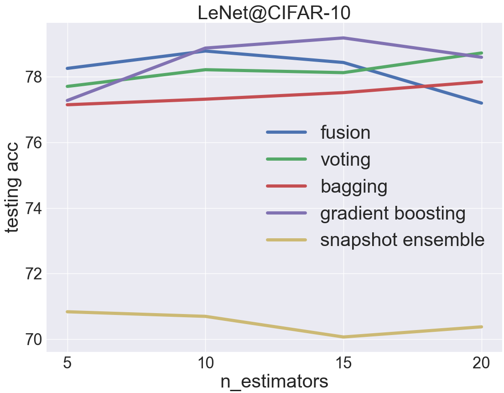
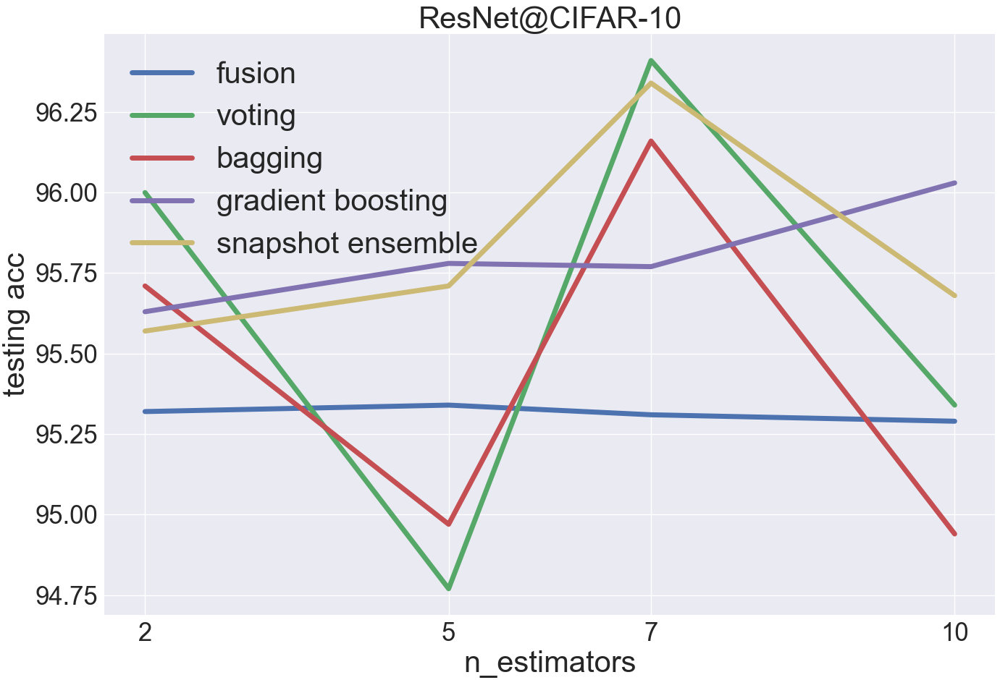
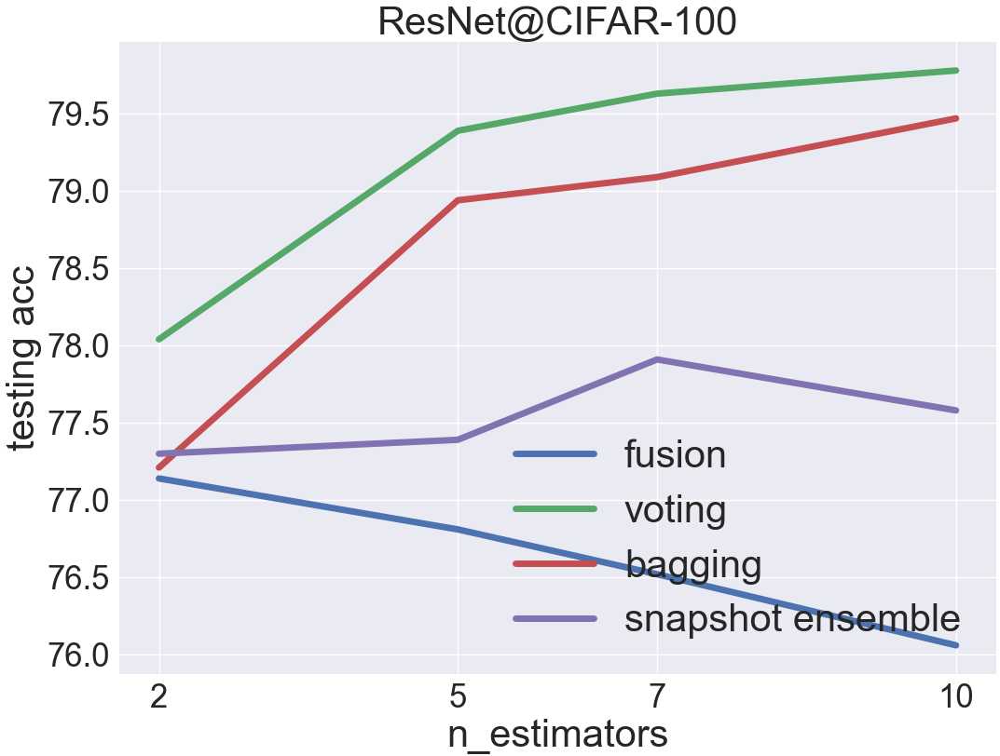

Experiments
===========

Setup
~~~~~

Experiments here are designed to evaluate the performance of each ensemble implemented in Ensemble-PyTorch. We have collected four different configurations on dataset and base estimator, as shown in the table below. In addition, scripts on producing all figures below are available on `GitHub <https://github.com/xuyxu/Ensemble-Pytorch/tree/master/docs/plotting>`__.

.. table::
   :align: center

   +------------------+----------------+-----------+-------------------+
   |   Config Name    |   Estimator    |  Dataset  |    n_estimators   |
   +==================+================+===========+===================+
   |    LeNet\@MNIST  |     LeNet-5    |   MNIST   |   5, 10, 15, 20   |
   +------------------+----------------+-----------+-------------------+
   |  LeNet\@CIFAR-10 |     LeNet-5    |  CIFAR-10 |   5, 10, 15, 20   |
   +------------------+----------------+-----------+-------------------+
   | ResNet\@CIFAR-10 |    ResNet-18   |  CIFAR-10 |    2, 5, 7, 10    |
   +------------------+----------------+-----------+-------------------+
   |ResNet\@CIFAR-100 |    ResNet-18   | CIFAR-100 |    2, 5, 7, 10    |
   +------------------+----------------+-----------+-------------------+

1. Data augmentations were adopted on both **CIFAR-10** and **CIFAR-100** datasets.
2. For **LeNet-5**, the ``Adam`` optimizer with learning rate ``1e-3`` and weight decay ``5e-4`` was used.
3. For **ResNet-18**, the ``SGD`` optimizer with learning rate ``1e-1``, weight decay ``5e-4``, and momentum ``0.9`` was used.
4. Reference code: `ResNet-18 on CIFAR-10 <https://github.com/kuangliu/pytorch-cifar>`__ and `ResNet-18 on CIFAR-100 <https://github.com/weiaicunzai/pytorch-cifar100>`__.

.. tip::

  For each experiment shown below, we have added some comments that may be worthy of your attention. Feel free to open an `issue <https://github.com/xuyxu/Ensemble-Pytorch/issues>`__ if you have any question on the results.

LeNet\@MNIST
~~~~~~~~~~~~

* MNIST is a very easy dataset, and the testing acc of a single LeNet-5 estimator is over 99%
* voting and bagging are the most effective ensemble in this case
* bagging is even better than voting since the bootstrap sampling on training data ingests more diversity into the ensemble
* fusion does not perform well in this case, possibly because the model complexity of a single LeNet-5 estimator is already sufficient for MNIST. Therefore, simply encapsulating several LeNet-5 estimators into a large model will only make the over-fitting problem more severe.

LeNet\@CIFAR-10
~~~~~~~~~~~~~~~

* CIFAR-10 is a hard dataset for LeNet-5, and the testing acc of a single LeNet-5 estimator is around 70%
* gradient boosting is the most effective ensemble because it is able to improve the performance of weak estimators by a large margin as a bias-reduction ensemble method
* bagging is worse than voting since less training data are available
* snapshot ensemble, more precisely, the customized learning rate scheduler in snapshot ensemble, does not adapt well with LeNet-5 (more training epochs are needed)

ResNet\@CIFAR-10
~~~~~~~~~~~~~~~~

* CIFAR-10 is a relatively easy dataset for ResNet-18, and the testing acc of a single ResNet-18 estimator is between 94% and 95%
* voting and snapshot ensemble are the most effective ensemble in this case
* snapshot ensemble is even better when taking the training cost into consideration

ResNet\@CIFAR-100
~~~~~~~~~~~~~~~~~

* CIFAR-100 is a hard dataset for ResNet-18, and the testing acc of a single ResNet-18 estimator is around 76%
* voting is the most effective ensemble in this case
* fusion does not perform well in this case
* the result of gradient boosting is omitted because of its prohibitively long training time

Acknowledgement
~~~~~~~~~~~~~~~

We would like to thank the `LAMDA Group <http://www.lamda.nju.edu.cn/MainPage.ashx>`__ from Nanjing University for providing us with the powerful V-100 GPU server.
