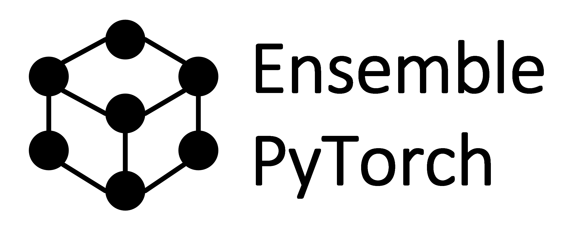

Ensemble-PyTorch Documentation
==============================

|github|_ |readthedocs|_ |codecov|_ |python|_

.. |github| image:: https://github.com/xuyxu/Ensemble-Pytorch/workflows/torchensemble-CI/badge.svg
.. _github: https://github.com/xuyxu/Ensemble-Pytorch/actions

.. |readthedocs| image:: https://readthedocs.org/projects/ensemble-pytorch/badge/?version=latest
.. _readthedocs: https://ensemble-pytorch.readthedocs.io/en/latest/index.html

.. |codecov| image:: https://codecov.io/gh/xuyxu/Ensemble-Pytorch/branch/master/graph/badge.svg?token=2FXCFRIDTV
.. _codecov: https://codecov.io/gh/xuyxu/Ensemble-Pytorch

.. |python| image:: https://img.shields.io/badge/python-3.6+-blue?logo=python
.. _python: https://www.python.org/

Ensemble-PyTorch implements a collection of ensemble methods using PyTorch. It provides:

* Easy ways to boost the performance of your deep learning models;
* Easy-to-use APIs on training and evaluating;
* High training efficiency.

To get started, please refer to `Quick Start <./quick_start.html>`__. To learn more about ensemble methods currently supported, please refer to `Introduction <./introduction.html>`__.

This package is under active development. Please feel free to open an `issue <https://github.com/AaronX121/Ensemble-Pytorch/issues>`__ if your have any problem. In addition, any feature request or `pull request <https://github.com/AaronX121/Ensemble-Pytorch/pulls>`__ would be highly welcomed.

.. toctree::
  :maxdepth: 2

   Quick Start <quick_start>
   Introduction <introduction>
   Experiment <experiment>
   API Reference <parameters>
   Changelog <changelog>
   Roadmap <roadmap>
