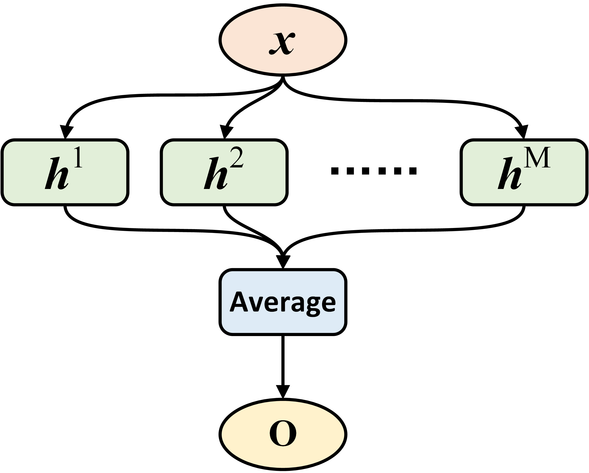
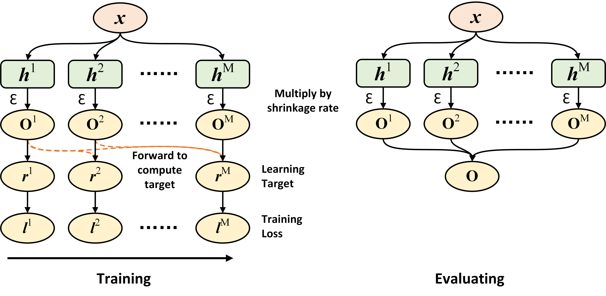

Introduction
============

This page briefly introduces ensemble methods implemented in Ensemble-PyTorch.

To begin with, below are some notations that will be used throughout the introduction.

- :math:`\mathcal{B} = \{\mathbf{x}_i, y_i\}_{i=1}^B`: A batch of data with :math:`B` samples;
- :math:`\{h^1, h^2, \cdots, h^m, \cdots, h^M\}`: A set of :math:`M` base estimators;
- :math:`\mathbf{o}_i^m`: The output of the base estimator :math:`h^m` on sample :math:`\mathbf{x}_i`. For regression, it is a scalar or a real-valued vector; For classification, it is a class vector with its size the number of distinct classes;
- :math:`\mathcal{L}(\mathbf{o}_i, y_i)`: Training loss computed on the output :math:`\mathbf{o}_i` and the ground-truth :math:`y_i`. For regression, it could be the mean squared error; For classification, it could be the cross-entropy loss for binary or multi-class classification.

Fusion
------

The output of fusion is the averaged output from all base estimators. Formally, given a sample :math:`\mathbf{x}_i`, the output of fusion is :math:`\mathbf{o}_i = \frac{1}{M} \sum_{m=1}^M \mathbf{o}_i^m`.

During the training stage, all base estimators in fusion are jointly trained with mini-batch gradient descent. Given the output of fusion on a data batch :math:`\mathcal{B}`, the training loss is: :math:`\frac{1}{B} \sum_{i=1}^B \mathcal{L}(\mathbf{o}_i, y_i)`. After then, parameters of all base estimator can be jointly updated with the auto-differentiation system in PyTorch and gradient descent. The figure below presents the data flow of fusion:

Voting and Bagging
------------------

Voting and bagging are popularly used ensemble methods. Basically, voting and bagging fits $M$ base estimators independently, and the final prediction takes average over the predictions from all base estimators.

Compared to voting, bagging further uses sampling with replacement on each batch of data. Notice that sub-sampling is not typically used when training neural networks, because the neural networks typically achieve better performance with more training data.

Gradient Boosting
-----------------

Gradient boosting trains all base estimators in a sequential fashion, as the learning target of a base estimator :math:`h^m` is associated with the outputs from base estimators fitted before, i.e., :math:`\{h^1, \cdots, h^{m-1}\}`.

Given the :math:`M` fitted base estimators in gradient boosting, the output of the entire ensemble on a sample is :math:`\mathbf{o}_i = \sum_{m=1}^M \epsilon \mathbf{o}_i^m`, where :math:`\epsilon` is a pre-defined scalar in the range :math:`(0, 1]`, and known as the shrinkage rate or learning rate in gradient boosting.

The training routine of the m-th base estimator in gradient boosting can be summarized as follow:

- **Decide the learning target on each sample** :math:`\mathbf{r}_i^m`: Given the ground truth :math:`y_i` and the accumulated output from base estimators fitted before: :math:`\mathbf{o}_i^{[:m]}=\sum_{p=1}^{m-1} \epsilon \mathbf{o}_i^p`, the learning target is defined as :math:`\mathbf{r}_i^m = - \frac{\partial\ \mathcal{L}(\mathbf{o}_i^{[:m]},\ y_i)}{\partial\ \mathbf{o}_i^{[:m]}}`. Therefore, the learning target is simply the negative gradient of the training loss :math:`\mathcal{L}` with respect to the accumulated output from base estimators fitted before :math:`\mathbf{o}_i^{[:m]}`;
- **Fit the m-th base estimator via least square regression**, that is, the training loss for the m-th base estimator is :math:`l^m = \frac{1}{B} \sum_{i=1}^B \|\mathbf{r}_i^m - \mathbf{o}_i^m\|_2^2`. Given :math:`l^m`, the parameters of :math:`h^m` then can be fitted using gradient descent;
- **Update the accumulated output**: :math:`\mathbf{o}_i^{[:m+1]} = \mathbf{o}_i^{[:m]} + \epsilon \mathbf{o}_i^m`, and then move to the training routine of the (m+1)-th base estimator.

For regression with the mean squared error, :math:`\mathbf{r}_i^m = \mathbf{y}_i - \mathbf{o}_i^{[:m]}`. For classification with the cross-entropy loss, :math:`\mathbf{r}_i^m = \mathbf{y}_i - \text{Softmax}(\mathbf{o}_i^{[:m]})`, where :math:`\mathbf{y}_i` is the one-hot encoded vector of the class label :math:`y_i`.

The figure below presents the data flow of gradient boosting during the training and evaluating stage, respectively. Notice that the training stage runs sequentially from the left to right.

Snapshot Ensemble [1]_
----------------------

Unlike all methods above, where :math:`M` independent base estimators will be trained, snapshot ensemble generates the ensemble by enforcing a single base estimator to converge to different local minima :math:`M` times. At each minima, the parameters of this estimator are saved (i.e., a snapshot), serving as a base estimator in the ensemble. The output of snapshot ensemble also takes the average over the predictions from all snapshots.

To obtain snapshots with good performance, snapshot ensemble uses **cyclic annealing schedule on learning rate** to train the base estimator. Suppose that the initial learning rate is :math:`\alpha_0`, the total number of training iterations is :math:`T`, the learning rate at iteration :math:`t` is:

.. math::
   \alpha_t = \frac{\alpha_0}{2} \left(\cos \left(\pi \frac{(t-1) \pmod{ \left \lceil T/M \right \rceil}}{\left \lceil T/M \right \rceil}\right) + 1\right).

Notice that the iteration above indicates the loop on enumerating all batches within each epoch, instead of the loop on iterating over all training epochs.

Adversarial Training [2]_
-------------------------

Adversarial samples can be used to improve the performance of base estimators, as validated by the authors in [2]. The implemented ``AdversarialTrainingClassifier`` and ``AdversarialTrainingRegressor`` contain :math:`M` independent base estimators, and each of them is fitted independently as in Voting and Bagging.

During the training stage of each base estimator :math:`h^m`, an adversarial sample :math:`\mathbf{x}_i^{adv}` is first generated for each sample :math:`\mathbf{x}_i` in the current data batch, using the fast gradient sign method (FGSM). After then, parameters of the base estimator is optimized to minimize the training loss :math:`\mathcal{L}(\mathbf{o}_i, y_i) + \mathcal{L}(\mathbf{o}_i^{adv}, y_i)`, where :math:`\mathbf{o}_i^{adv}` is the output of :math:`h^m` on the adversarial sample :math:`\mathbf{x}_i^{adv}`. Clearly, this training loss encourages each base estimator to perform well on both original samples and adversarial samples.

Same as Voting and Bagging, the output of ``AdversarialTrainingClassifier`` or ``AdversarialTrainingRegressor`` during the evaluating stage is the average over predictions from all base estimators.

**References**

.. [1] Huang Gao, Sharon Yixuan Li, Geoff Pleisset, et al., "Snapshot ensembles: Train 1, get m for free." ICLR, 2017.
.. [2] Balaji Lakshminarayanan, Alexander Pritzel, Charles Blundell., "Simple and Scalable Predictive Uncertainty Estimation using Deep Ensembles." NIPS 2017.